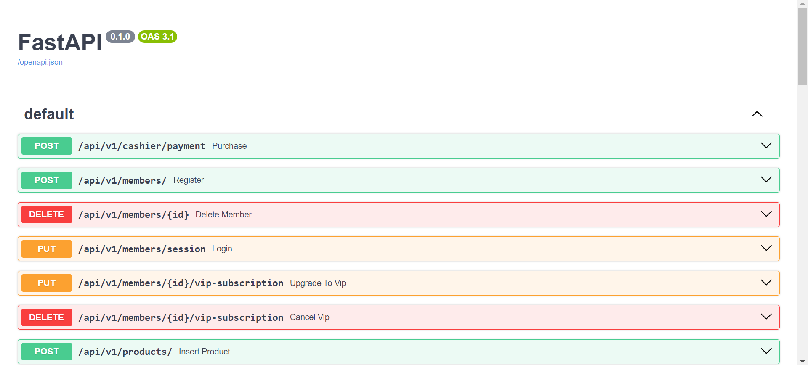
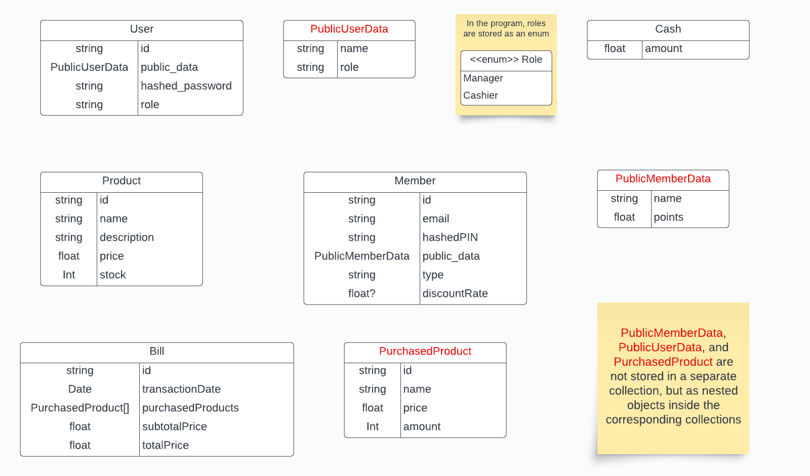
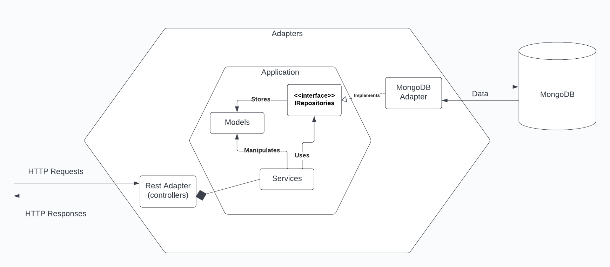
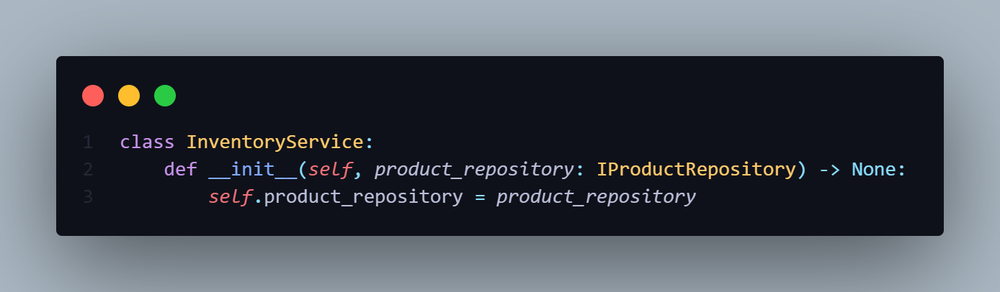
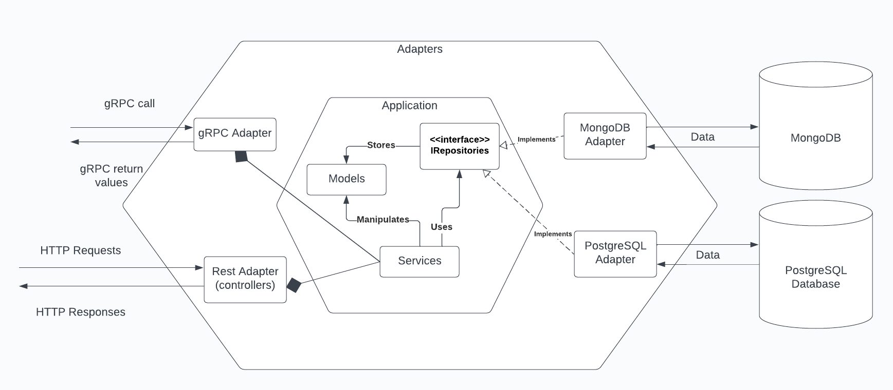
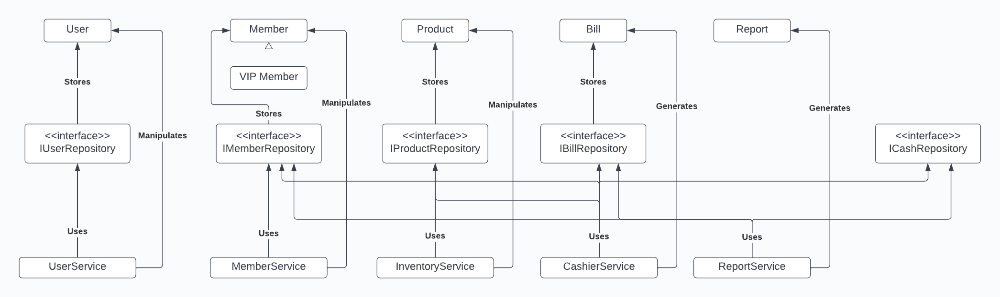
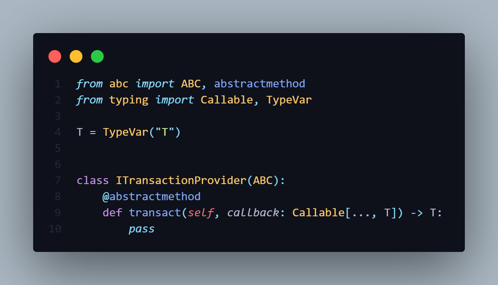
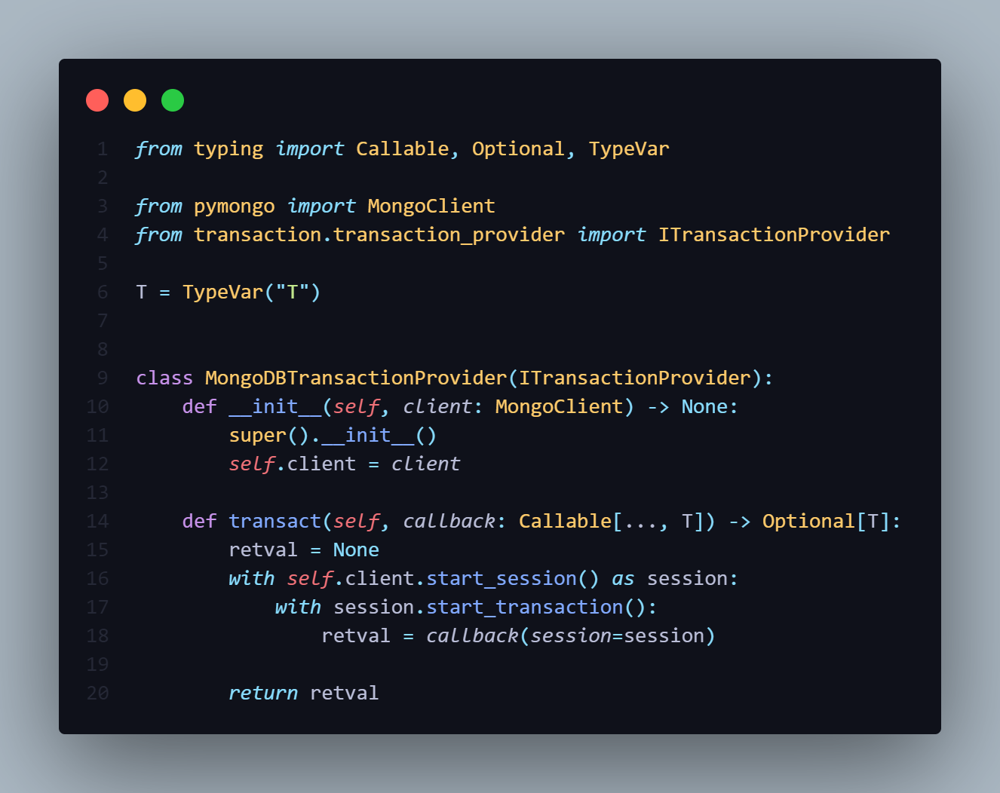
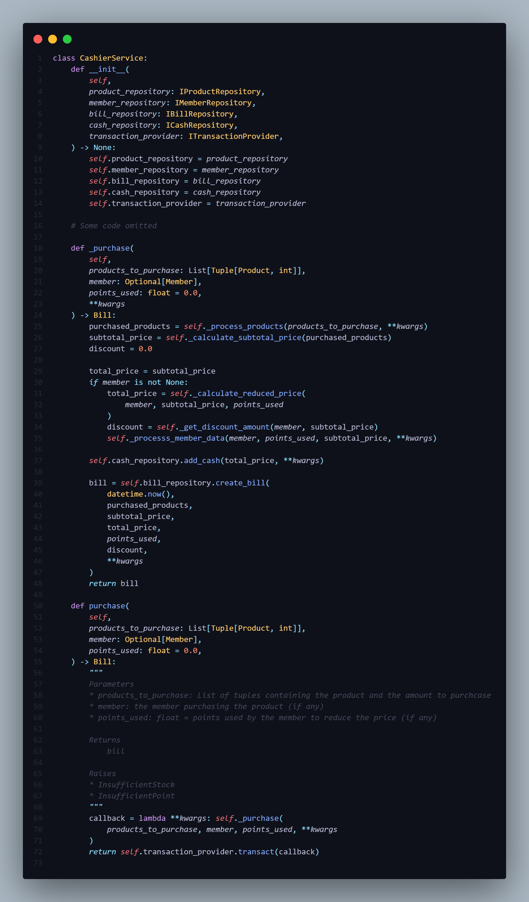

# Point of Sales Web Service

## Description

A web service that provides functionalities for product purchase, product inventory management, and report generation in a store. See the **[DOCS]** for more information.

## Preliminary requirements

1. User authentication

    User roles:

    - Cashier –> can search products, make payments, and register members
    - Manager —> can do CRUD operations on products and get timely reports about the shop (e.g. total revenue this month, number of transactions, products out of stock, etc.)

2. Entities:

    - User (cashier and manager)
    - Member
    - Product
    - Bill (generated every time a payment is completed)
    - Report

3. Services:

    - Inventory service —> CRUD of products
    - Cashier service —> payments
    - Member service —> registration, authentication, VIP program
    - User service —> registration, authentication
    - Report service —> generate reports about the current situation

4. Membership program

    Customers can register to become a member
    Members can earn points equivalent to 15% of the total transaction cost for each transaction, and these points can be redeemed in subsequent transactions.
    Members can upgrade their membership to VIP and VIP can downgrade their membership to regular member.
    VIP members can get a fixed discount of 15% (point also applies for VIP members). The point multiplier and discount rate values can be changed anytime

## How to run

-   Make the environment variables in the .env file in the root directory. You can use copy from .env.example

    ```
    cp .env.example .env
    ```

-   Make the key for JWT. You can create a .key file in the /src directory and fill it with any string. You can also copy from .key.example in the /src directory

    ```
    cp src/.key.example src/.key
    ```

-   Run docker desktop, and start the container from your terminal

    ```
    docker compose up
    ```

-   Initiate mongoDB replica set (only do this once)

    ```
    // Find the container ID of the mongodb container
    docker ps

    // Execute mongosh in that container
    docker exec -it <container ID> mongosh --username your_username --password your_password

    // Initiate the replica set
    rs.initiate()
    ```

-   [Optional] Import the product mock data

    ```
    mongoimport --host localhost:27017 --username your_username --password your_password --db PosDB --collection product --drop --file /usr/src/product_mock.json --authenticationDatabase admin --jsonArray
    ```

-   Access the API documentation through http://localhost:8000/docs#/ and try out the APIs
    

## Tech used


## Project structure

See the **[DOCS]** for more information about the project structure

```
│   .env
│   .env.example
│   .gitignore
│   docker-compose.yml
│   README.md
│   requirements.txt
│
├───dockerfiles
│       Dockerfile.mongodb
│       Dockerfile.web
│
├───mongo_setup
│       mongo.key
│       mongo.key.example
│       product_mock.json
│
└───src
    │   .key
    │   .key.example
    │   bootstrap.py
    │   main.py
    │
    ├───core
    │   ├───models
    │   │       .gitkeep
    │   │       bill.py
    │   │       member.py
    │   │       product.py
    │   │       report.py
    │   │       user.py
    │   │
    │   ├───repositories
    │   │       .gitkeep
    │   │       bill.py
    │   │       cash.py
    │   │       member.py
    │   │       product.py
    │   │       user.py
    │   │
    │   └───services
    │           .gitkeep
    │           cashier.py
    │           inventory.py
    │           member.py
    │           report.py
    │           user.py
    │
    ├───exceptions
    │       auth_exception.py
    │       transaction_exception.py
    │
    ├───infrastructure
    │   ├───adapters
    │   │   ├───db
    │   │   │   └───mongodb
    │   │   │       │   .gitkeep
    │   │   │       │   base_repository.py
    │   │   │       │   create_index.py
    │   │   │       │   transaction_provider.py
    │   │   │       │
    │   │   │       └───repositories
    │   │   │               bill.py
    │   │   │               cash.py
    │   │   │               member.py
    │   │   │               product.py
    │   │   │               user.py
    │   │   │
    │   │   └───rest
    │   │       ├───controllers
    │   │       │       cashier.py
    │   │       │       member.py
    │   │       │       product.py
    │   │       │       report.py
    │   │       │       user.py
    │   │       │
    │   │       ├───middlewares
    │   │       │       .gitkeep
    │   │       │       cashier_auth.py
    │   │       │       cashier_manager_auth.py
    │   │       │       manager_auth.py
    │   │       │       member_auth.py
    │   │       │
    │   │       ├───schemas
    │   │       │       member.py
    │   │       │       product.py
    │   │       │       purchase.py
    │   │       │       response_message.py
    │   │       │       user.py
    │   │       │
    │   │       └───utils
    │   │               date_utils.py
    │   │               file_writer.py
    │   │               jwt_utils.py
    │   │               validation.py
    │   │
    │   └───containers
    │           .gitkeep
    │           controller.py
    │           db.py
    │           repository.py
    │           security.py
    │           service.py
    │           transaction.py
    │
    ├───security
    │   │   hasher.py
    │   │
    │   └───bcrypt
    │           hasher.py
    │
    ├───static
    │   │   .gitkeep
    │   │
    │   └───product
    │       └───images
    └───transaction
            transaction_provider.py
```

## Database design

Here's the database schema used in this application. To see other information about the database such as indexes and query plans, see the **[DOCS]**


## Architecture

This application uses the Hexagonal Architecture. Hexagonal architecture, also known as Ports and Adapters architecture, is a design pattern for software architecture that promotes the separation of concerns and modularization of components. This architecture puts business logic inside the core of the hexagon and technical details in the outer layer of the hexagon. The core components provide “ports” that can be plugged with the “adapters” or the technical details. These adapters act as bridges between the core business logic and the external components, such as user interfaces, databases, or third-party services.


In the core layer, there are three components:

-   Models

    → representation of entities in the business

-   Repositories

    → interface for storing, retrieving, and manipulating model data

-   Services
    → use cases provided by the application, often interacting with repositories to execute specific functionalities

In the adapter layer, we have

-   REST adapter, which has some services (represented by a composite symbol in UML). This means that the rest adapter can call methods provided by the service class in response to HTTP requests towards API endpoints.

-   MongoDB adapter, which implements methods/contracts defined by the Repository interface.

The ports that tell the application what to do (e.g. the REST adapter) are called the **driving port**, and the ports that are driven by the application (e.g. the MongoDB adapter) are called the **driven port**.

In this architecture, we also apply dependency injection, which means that objects that depend on other objects do not instantiate the dependencies internally. Instead, they receive these dependencies through their constructors.



In the example above, the InventoryService class is injected with the IProductRepository interface, meaning that it doesn’t need to care about the technical implementation of the repository, whether it be a mongoDB repository, a PostgreSQL repository, or even a file system repository made from scratch, as long as it implements the the repository interface.

Let’s say, hypothetically, we want to extend our application to serve for gRPC and store data in a PostgreSQL database. All we need to do is create a gRPC adapter composed of service classes needed and a PostgreSQL adapter that implements the repository interface. We don’t need to change the business logic or internal part of our application because it does not care about the technical implementation.



## Class diagram

Here's the abstract level class diagram. To see the implementation level class diagram, see the **[DOCS]**



## Highlights – some findings when I developed the app

1. Transaction provider

    **Issue**
    Some services need to be wrapped inside a transaction since it might need read/write access to multiple documents and we need to preserve the ACID property of the database. Wrapping some operations into a transaction usually comes like this

    ```
    transaction.begin()
    // perform all operations in the service
    transaction.commit()

    // Or a more pythonic way
    with transaction.begin() as foo:
        // perform all operations in the service
    ```

    However, the transaction mechanisms can vary based on the type of DBMS used. For example, a mongoDB transaction must happen within a session and the session must be inserted as a parameter of the method used for manipulating the collection like this.

    ```
    with client.start_session() as session:
        with session.start_transaction():
            collection_one.insert_one({"abc": 1}, session=session)
    ```

    The problem is, the Service classes don’t know – and aren’t supposed to know – about these technical details. How are we supposed to solve this issue?

    **My Solution**

    - Create an interface called ITransactionProvider. This transaction has a transact() method that accepts any functions (callable) which are going to be wrapped inside a transaction

        

    - Implement the concrete mongoDB transaction provider like this

        

    - Use the transaction provider in your service class

        

        As you can see, the public purchase() method wraps the private \_purchase() method inside a lambda function that accepts a **kwargs, and then pass the lambda function into the transaction_provider.transact() method.
        In the methods of the concrete mongoDB repository, you can check if **kwargs contains “session” variable and use it accordingly (for example, here in the bill repository)

        How do we know that it’s actually using the session we created in the transaction? Here's the explanation

        - The public purchase() method wraps the private \_purchase() method inside a lambda function that accepts a \*\*kwargs, and then pass the lambda function into the transaction_provider.transact() method.
        - The concrete mongoDB transaction provider starts the session and transaction, and call the callback function we’ve created earlier using the lambda function, and passes the session as the \*\*kwargs of the callback
        - The callback function will be called with session as the \*\*kwargs, so the session will also get passed to every operations inside the callback that access the repository.

-   To me, this is a nice solution, because
    -   It keeps the details away from the service class
    -   It combines the beauty of ✨Object-Oriented Programming✨ and ✨Functional Programming✨

2. SQL vs MongoDB

    Since this is the first time I used MongoDB, here's what I noticed
    
    

3. More highlights in the **[DOCS]**

[DOCS]: https://docs.google.com/document/d/1etwMZnsr0rigjT1xxQLdugstv-jT-6aznf2accjamJM/edit?usp=sharing
